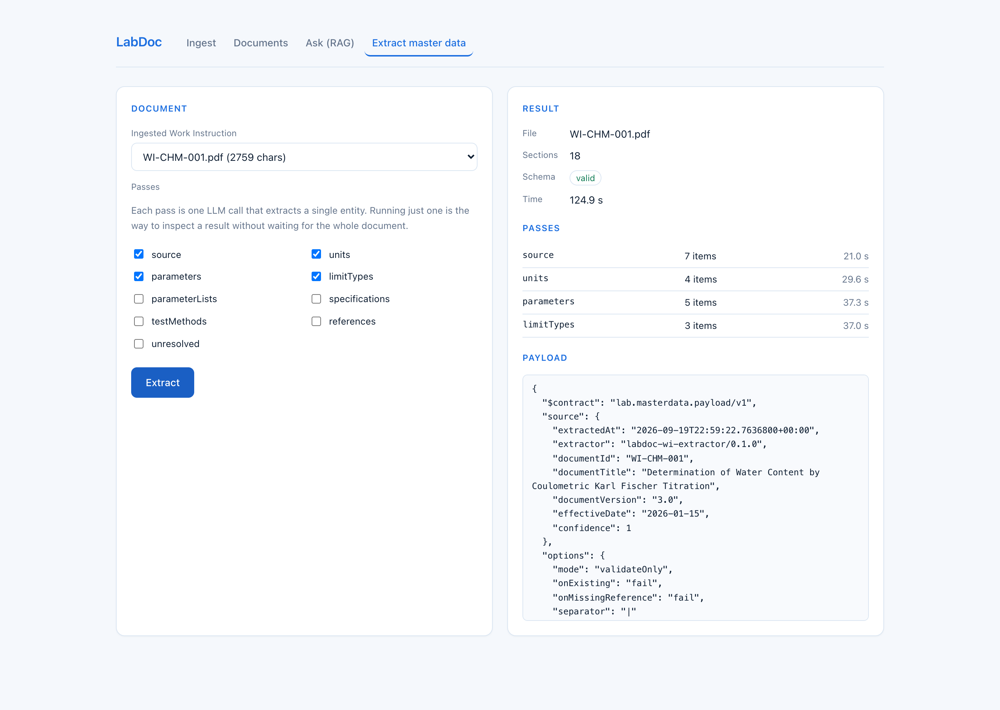

# LabDoc

Turn laboratory procedures into answers and into LIMS master data — locally, with no paid API.

A laboratory's knowledge lives in Work Instructions and SOPs: PDFs describing how a test is run,
what is measured, in what units, and against which limits a result passes or fails. That creates
two recurring costs:

- **Analysts read to find one line.** "What PPE does this method need?", "What is the drift limit?"
  — a question that takes seconds to ask takes minutes to look up.
- **Someone retypes the whole thing into the LIMS.** Every parameter, unit, data type,
  specification and limit is transcribed by hand from the document into the system. It is slow,
  and a typo in a limit is a quality event.

LabDoc ingests the document once and solves both from the same source.

| | |
|---|---|
| **Ask** | Natural-language questions answered from the procedures, with the source excerpts and scores shown, so every answer is traceable. |
| **Extract** | The document turned into a structured master data payload — units, parameters, parameter lists, limit types, specifications, test methods — validated against a JSON Schema and ready to be loaded into a LIMS. |



*Four of the nine passes running over the sample work instruction. Each row is one LLM call; the
payload on the right is assembled from all of them and validated against the contract.*

Everything runs on your machine. No API keys, no data leaving the lab — which is usually the
blocker for this kind of tool in a regulated environment.

## Run it

Requires Docker and [Ollama](https://ollama.com).

```bash
ollama pull bge-m3
ollama pull qwen2.5:7b

docker compose --profile api up -d --build
```

| | |
|---|---|
| UI | http://localhost:4301 |
| API + Scalar docs | http://localhost:8081/scalar |
| Qdrant dashboard | http://localhost:6335/dashboard |

A sample work instruction ships in [`samples/`](samples/). Open the UI, upload it on the **Ingest**
tab, then use **Ask** and **Extract master data**.

### From the command line

```bash
# 1. Ingest a procedure
curl -F "file=@samples/WI-CHM-001.pdf" -F "sourceSystem=WI" \
     http://localhost:8081/api/v1/ingest

# 2. Ask a question about it
curl -X POST http://localhost:8081/api/v1/ask \
     -H 'Content-Type: application/json' \
     -d '{"question":"What PPE is required, and what is the cell drift limit?","topK":3}'

# 3. Extract master data (documentId comes from step 1)
curl -X POST http://localhost:8081/api/v1/extract \
     -H 'Content-Type: application/json' \
     -d '{"documentId":"<id>","passes":["source","units","parameters"]}'
```

`passes` selects which entities to extract — leave it empty to run all nine. Running one at a time
is the fast way to inspect a single entity.

| Endpoint | |
|---|---|
| `POST /api/v1/ingest` | upload a PDF; idempotent by content hash |
| `GET  /api/v1/documents` | what has been ingested |
| `POST /api/v1/ask` | question → answer + sources |
| `POST /api/v1/extract` | document → validated master data payload |

## The payload

One document produces one payload, designed to be reviewed before it is loaded:

```json
{
  "$contract": "lab.masterdata.payload/v1",
  "source":  { "documentId": "WI-CHM-001", "documentVersion": "3.0", "confidence": 1 },
  "options": { "mode": "validateOnly", "onExisting": "fail" },
  "units":      [ { "unitId": "UG/MIN", "unitDesc": "ug/min" } ],
  "parameters": [ { "parameterId": "KF_CELL_DRIFT", "parameterDesc": "Cell drift" } ],
  "unresolved": [ { "section": "9.4", "text": "…", "reason": "value comes from another record" } ]
}
```

Three parts make it safe to trust:

- **`_source` on every item** — the section and row it came from, plus a confidence. A wrong
  payload is otherwise indistinguishable from a right one.
- **`unresolved[]`** — the human review queue. Anything the model recognised but could not map
  lands here instead of being invented as a field.
- **`mode: validateOnly`** — the payload is a proposal. Loading it is a separate, deliberate step.

The contract is [`lab-masterdata.schema.json`](src/LabDoc.Api/Schemas/lab-masterdata.schema.json),
and every extraction is validated against it before it is returned.

## Measuring it

A payload that looks plausible and is quietly incomplete is the failure mode that
matters here, and no amount of reading output catches it. So extraction is scored
against a hand-written expected payload:

```bash
docker compose --profile api up -d --build
dotnet run --project tools/LabDoc.Eval -- --report docs/eval-report.json
```

Every `samples/*.expected.json` is ingested, extracted and graded. Current result on
the sample procedure, `qwen2.5:7b` running locally:

| entity | recall | precision |
|---|---|---|
| units | 100% | 100% |
| parameters | 100% | 100% |
| limitTypes | 100% | 75% |
| parameterLists | 0% | 0% |
| parameter list items | 100% | 100% |
| specifications | 0% | 0% |
| parameter limits | 100% | 100% |
| test methods | 100% | 100% |
| **total** | **89%** | **80%** |

**Recall is the metric that matters.** A parameter that was never extracted leaves a
payload that still validates, still reads well, and is wrong. A wrong value is at
least visible.

### What the measurement changed

Independent LLM calls share no vocabulary: one pass emitted `CELL_DRIFT`, the next
`KF_CELL_DRIFT` for the same parameter, and nothing downstream could join them. The
fix was to feed each pass the identifiers earlier passes already produced. It is a
switch, so the effect is measured rather than assumed — `Extraction:ChainPasses`:

| | chaining off | chaining on |
|---|---|---|
| recall | 78% | **89%** |
| precision | 70% | **80%** |
| identifier drift | 29% | **21%** |
| parameter limits, recall | 0% | **100%** |
| specifications, recall | 50% | **0%** |

Two things worth reading honestly in that table. Parameter limits went from nothing
to everything: without the shared vocabulary the model put the *operator* in the
limit type field (`less_than_or_equal` instead of `release_limit`). And
specifications went the other way — chaining made that pass worse, not better.

The harness also pays for itself outside the score. It surfaced a bug that had been
hiding as slowness: the OpenAI SDK defaults to a 100 second network timeout and then
retries four times, so a local model generating a nested schema was being killed
mid-generation. One pass was failing after four attempts while the endpoint still
returned HTTP 200 with an incomplete payload. Fixing the timeout took the slowest
pass from 398s to 81s.

### Known failures

Named, not hidden — they are what the next round of work targets:

- **specifications, 0%** — the document has OOS and non-OOS limits, which is two
  specifications because the flag lives on the specification. The model emits one per
  limit instead. Conditional grouping is where a 7B model gives out.
- **identifier drift, 21%** — the remaining matches found by label rather than by id.
- **units expanded** — `ug/min` came back as `microgram per minute`, despite the
  prompt forbidding normalisation. In a regulated context the document's unit is the
  unit.

## How it works

```
                    ┌─ PDF ─→ text ─→ full_text + sections ─→ Postgres
   ingest ──────────┤
                    └─ chunks ─→ bge-m3 ─→ Qdrant (deterministic ids)

   ask       question ─→ bge-m3 ─→ Qdrant top-K ─→ numbered context ─→ LLM ─→ answer + sources

   extract   document ─→ sections ─┬─→ pass 1 (schema) ─→ LLM ─┐
                                   ├─→ pass 2 (schema) ─→ LLM ─┼─→ envelope ─→ JSON Schema ─→ payload
                                   └─→ pass N (schema) ─→ LLM ─┘
```

**The two pipelines are deliberately different.** Asking is retrieval: pull the few chunks that
answer the question. Extraction cannot retrieve — if the search returns the top 4 chunks of a
procedure, parameters are lost silently, and a plausible incomplete payload is worse than an
obviously broken one. So extraction iterates the whole document instead, with no embeddings and
no vector search on that path.

Things worth opening if you read code:

- **Structured output is grammar-constrained, not prompted.** `response_format: json_schema` makes
  tokens outside the schema impossible to emit.
  [`ChatService.cs`](src/LabDoc.Api/Services/ChatService.cs)
- **Extraction passes are data, not code.** One list entry per entity: what to extract, the schema
  fragment that constrains it, which sections feed it.
  [`MasterDataPasses.cs`](src/LabDoc.Api/Services/MasterDataPasses.cs)
- **Two kinds of guard rail.** An empty search result short-circuits in C# and never reaches the
  LLM — a guarantee. "Say you don't know" in the prompt is only a request.
  [`RagAskService.cs`](src/LabDoc.Api/Services/RagAskService.cs)
- **Re-ingest is free.** Identity is `content hash + embedding model + collection + chunk config`,
  and Qdrant point ids are `SHA256(documentId:chunkIndex)`, so an upsert overwrites instead of
  duplicating. [`RagIngestService.cs`](src/LabDoc.Api/Services/RagIngestService.cs)

## Stack

| | |
|---|---|
| API | .NET 10 minimal API, Scalar for OpenAPI |
| Embeddings | `bge-m3` (1024-d, multilingual) via Ollama |
| Generation | `qwen2.5:7b` via Ollama, OpenAI-compatible endpoint |
| Vector store | Qdrant, gRPC, cosine |
| Metadata | PostgreSQL 17 |
| UI | Angular 22, standalone components + signals |
| Validation | JsonSchema.Net |

## License

MIT
